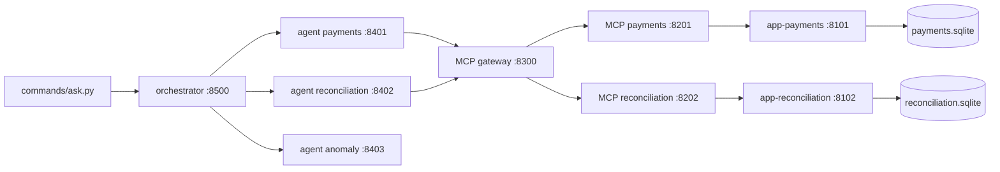

# ai-agents

Runnable example of one orchestrator and three specialist agents. An operator asks, in Portuguese, whether a customer was processed today, how reconciliation looks, and whether there is an anomaly. The orchestrator uses the more capable model. The specialists use the cheaper model. A tool call crosses the MCP gateway, and every read comes from a replica.

The article is in Portuguese: [article/article.md](article/article.md). Folder names, protocols, and these READMEs are in English.

## Responsibility

This repository shows the path of one support question across two domains. It does not fix data, move money, or write to a transactional database.

- [app-payments](app-payments) answers whether one customer had payment processing on a business date, and whether it succeeded or failed.
- [app-reconciliation](app-reconciliation) answers whether that customer's reconciliation is updated, pending, or in error.
- [commands](commands) loads both replicas and either leaves the stack up for questions or runs a closed demo.

The `anomaly` specialist is not a domain. It compares the two reports and has no database and no tool.

## What this is

Two read APIs, two MCP servers, one gateway, three agents, and one orchestrator. Shared JSON shapes live in `src/contracts/`. The session manifest lists the three customers for the current load. The public catalog exposes only the business date and the customer ids.

## How it works

A question enters the orchestrator on port `8500`. The customer id is taken from the text with the pattern `C-` plus four digits. No id returns the catalog. An id outside the load is refused. An id from the load calls the three agents, in order: `payments`, `reconciliation`, then `anomaly`.



`anomaly` receives the two reports and does not call the gateway. The gateway allowlists the tool, checks that the customer is the one on the task and in the catalog, applies the rate limit and the call budget, redacts secrets, and appends a line to `var/audit.jsonl`. Each MCP server calls only its own read API. Each API reads only its own SQLite replica and returns `source: replica` and `as_of`.

`commands/serve.py` and `commands/run_demo.py` call `load_session` in `app-payments/load.py`. That draws three customers, writes both replicas, and saves `var/session.json`. The orchestrator and the gateway read that file through `src/contracts/manifest.py`.

Without `OPENAI_API_KEY`, the answer text is filled from the replica JSON. With a key, `ORCHESTRATOR_MODEL` rewrites the orchestrator prose and `SPECIALIST_MODEL` rewrites the specialist summaries. Status fields still come from a validated replica envelope. Each question has its own deadline (`INVESTIGATION_DEADLINE_SECONDS`, default 16). Time is split across the specialist calls, with one second held back to return the parecer. A specialist response counts only when its envelope belongs to that question. If the model is slow or the provider fails, the answer stays on the deterministic text. The field rules are in [src/contracts/README.md](src/contracts/README.md).

## Layout

| Path | Responsibility |
| --- | --- |
| [app-payments](app-payments) | Payments read API and the session load |
| [app-reconciliation](app-reconciliation) | Reconciliation read API and its replica load |
| [commands](commands) | Start the stack, ask questions, or run the closed demo |
| `src/mcp_servers/` | One MCP server per domain: `get_processing`, `get_reconciliation` |
| `src/gateway/` | Allowlist, rate limit, call budget, redaction, audit log |
| `src/agents/` | `payments`, `reconciliation`, and `anomaly` |
| `src/orchestrator/` | Catalog, refusal, and the parecer |
| `src/contracts/` | Shared JSON. The parecer separates technical outcome from the business conclusion. See [src/contracts/README.md](src/contracts/README.md). |
| `src/replica/` | Read routes used by both apps |
| `tests/` | Permissions, replica, rate limit, and redaction, with no model call |
| `article/article.md` | Portuguese walkthrough of the same path |

`var/`, `.venv/`, and `.env` are created locally and stay out of Git.

## How to run

Python 3.12.

```bash
uv venv --python 3.12 .venv
uv pip install --python .venv/bin/python \
  "fastapi>=0.115" "uvicorn>=0.32" "httpx>=0.27" "pydantic>=2.10" \
  "mcp>=1.9" "a2a-sdk>=1.2" "pytest>=8.3"
```

Tests, then the closed demo. `CARGA_SEED=7` fixes the three customer ids.

```bash
.venv/bin/python -m pytest
CARGA_SEED=7 .venv/bin/python commands/run_demo.py
```

To leave the stack up and type questions, use two terminals. The first stays running:

```bash
CARGA_SEED=7 .venv/bin/python commands/serve.py
```

After it prints `up at http://127.0.0.1:8500`:

```bash
.venv/bin/python commands/ask.py
```

Variable names are in `.env.example`. Copy it to `.env` when you want a model to rewrite the prose.
